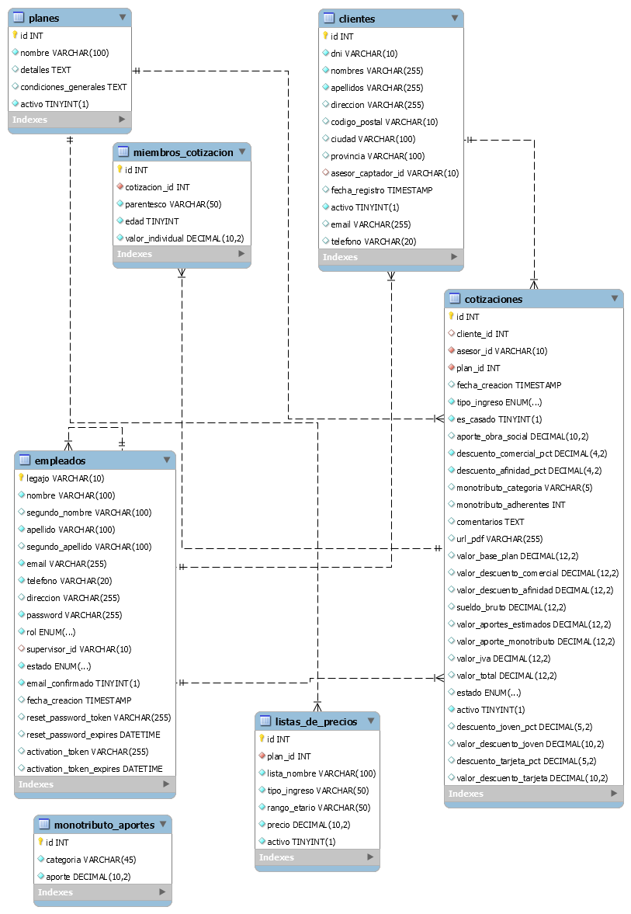

# Proyecto SIGEC - Backend

Sistema de Gestión de Cotizaciones (SIGEC) es una aplicación full-stack diseñada para optimizar el proceso de venta de planes de salud para asesores comerciales.

Este repositorio contiene el **backend** de la aplicación, que incluye:

* Una **API RESTful** completa construida con Node.js y Express.
* Autenticación y autorización (Asesores, Supervisores, Admin) usando **JWT** (JSON Web Tokens).
* Gestión completa (CRUD) de Clientes, Planes y Empleados.
* Un **motor de cálculo** dinámico para cotizaciones.
* Generación de documentos **PDF** de cotización sobre la marcha (vía `pdfmake`).
* Documentación de API interactiva y automatizada con **Swagger**.
* **Una suite de 10 pruebas de integración (testing) automatizadas con Jest y Supertest.**

---

## Documentación de la API (Swagger)

Toda la documentación interactiva de la API, donde se pueden probar todos los endpoints, se encuentra disponible una vez que el servidor está en funcionamiento.

**Para ver la documentación:**

1.  Inicia el servidor:
    ```bash
    npm run dev
    ```
2.  Abre la siguiente URL en tu navegador:
    [**http://localhost:5000/api/docs**](http://localhost:5000/api/docs)

---

## Diagrama de la Base de Datos (DER)

Este es el Diagrama de Entidad-Relación que muestra la estructura de la base de datos de SIGEC.



---

## Instalación

1.  **Clona el repositorio:**
    ```bash
    git clone [https://github.com/ysivira/backend-sigec](https://github.com/ysivira/backend-sigec)
    ```
2.  **Instala las dependencias:**
    ```bash
    npm install
    ```
3.  **Configura tus variables de entorno:**
    * Crea un archivo `.env` en la raíz del proyecto.
    * **Usa el archivo `.env.example` como plantilla.** Este archivo incluye las credenciales de la base de datos, `JWT_SECRET` y las **variables para la configuración del servidor de email (SMTP)**, que son cruciales para el registro de usuarios.

4.  **Prepara la Base de Datos de Desarrollo:**
    * **Esta configuración es solo para correr el servidor de desarrollo (`npm run dev`).**
    * Abre tu herramienta de base de datos (DBeaver, MySQL Workbench, etc.).
    * Crea una nueva base de datos con el nombre que pusiste en `DB_NAME` en tu `.env` (ej. `sigec_db`).
    * **Paso 4a:** Abre esa base de datos y **ejecuta el script `schema_v2.sql`** (para crear las tablas vacías).
    * **Paso 4b:** Inmediatamente después, **ejecuta el script `data.sql`** (para cargar los datos de ejemplo y el usuario admin).

5.  **Inicia el servidor:**

    Tienes dos opciones para iniciar el servidor:

    ### Para Desarrollo (Recomendado)
    Este comando usa `nodemon` para reiniciar el servidor automáticamente cada vez que guardas un cambio en el código.

    ```bash
    npm run dev
    ```

    ### Para Producción
    Este comando ejecuta el servidor una sola vez. (Asegúrate de tener `"start": "node index.js"` en tu `package.json`).

    ```bash
    npm start
    ```

---

## **Pruebas (Testing)**

Este proyecto incluye una suite completa de 10 pruebas de integración automatizadas que validan toda la lógica de la API (Autenticación, Clientes y Cotizaciones).

Las pruebas se ejecutan contra la base de datos de prueba (definida en `TEST_DB_NAME`), la cual se **crea y destruye automáticamente** en cada ejecución. No necesitas configurar `schema.sql` para las pruebas.

**Para ejecutar todas las pruebas:**
```bash
npm test
```
---

## **Primeros Pasos y Flujo de Trabajo**

¡Tu instancia de SIGEC está lista! Para usarla, debes seguir el flujo de roles:

### 1. Acceso como Administrador

El script `data.sql` ha creado un super-usuario Administrador para ti. Estos son los datos para ingresar al sistema a través de la pantalla de login:

* **Legajo:** `admin`
* **Clave:** `admin2025*`

### 2. Flujo de Cotización (Asesor)

El sistema está diseñado para que los asesores se registren, pero no puedan cotizar hasta que completen el flujo de seguridad de 3 pasos:

1.  **Registro y Confirmación:** Un nuevo asesor se registra a través del formulario de registro. Al finalizar, el sistema (usando las credenciales del `.env`) le enviará un correo para confirmar su dirección de email. El asesor debe hacer clic en ese enlace.
2.  **Activación (Tarea del Admin):** Una vez que el email del asesor está verificado, el **Administrador** (con su sesión iniciada) debe ir a su panel de administración, buscar al asesor pendiente y "activar" su cuenta.
3.  **Acceso Concedido:** Al ser activado, el asesor recibirá un correo de bienvenida. A partir de ese momento, podrá iniciar sesión en el sistema y comenzar a crear cotizaciones.